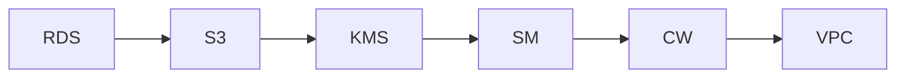

# InfraTales | AWS CDK Security as Code: VPC, IAM, KMS, WAF and Config in One Stack

**AWS CDK (TYPESCRIPT) reference architecture — security pillar | advanced level**

> Your security audit just flagged 23 findings because someone manually clicked through the AWS console to 'harden' a VPC six months ago and nobody can reproduce what they did. CloudTrail is enabled but not in every region, Config rules exist but were never enforced, and IAM policies grew by copy-paste until least-privilege became a memory. The real problem is that security configuration in most AWS accounts is undocumented tribal knowledge, not code — and the next compliance review or incident will expose exactly that gap.

[](LICENSE)
[](CONTRIBUTING.md)
[](https://aws.amazon.com/)
[-IaC-purple.svg)](https://aws.amazon.com/cdk/)
[](https://infratales.com/aws-cdk-security-as-code-vpc-iam-kms-and-config-stack/)
[](https://infratales.com)


## 📋 Table of Contents

- [Overview](#-overview)
- [Architecture](#-architecture)
- [Key Design Decisions](#-key-design-decisions)
- [Getting Started](#-getting-started)
- [Deployment](#-deployment)
- [Docs](#-docs)
- [Full Guide](#-full-guide-on-infratales)
- [License](#-license)

---

## 🎯 Overview

The stack provisions a multi-AZ VPC with strict subnet isolation — public, private, and isolated tiers — then places EC2 workloads exclusively in private subnets behind security groups generated from a central SecurityConfig class. KMS customer-managed keys encrypt S3, Secrets Manager, and CloudTrail at rest, with CloudTrail writing to a locked-down S3 bucket and shipping to CloudWatch Logs for near-real-time alerting. AWS Config records resource-level changes and enforces managed rules, WAF protects any public-facing endpoints, and all credentials are vended through Secrets Manager rather than environment variables — every one of these controls is expressed as CDK TypeScript constructs so the security posture is reproducible, diffable, and PR-reviewable.

**Pillar:** SECURITY — part of the [InfraTales AWS Reference Architecture series](https://infratales.com).
**Target audience:** advanced cloud and DevOps engineers building production AWS infrastructure.

---

## 🏗️ Architecture



> 📐 See [`diagrams/`](diagrams/) for full architecture, sequence, and data flow diagrams.

> Architecture diagrams in [`diagrams/`](diagrams/) show the full service topology (architecture, sequence, and data flow).
> The [`docs/architecture.md`](docs/architecture.md) file covers component responsibilities and data flow.

---

## 🔑 Key Design Decisions

- Customer-managed KMS keys add ~$1/key/month plus $0.03 per 10,000 API calls — trivial at low volume but can become a surprise line item when CloudTrail, Config, and S3 all generate high call rates at scale [inferred]
- AWS Config continuous recording costs ~$0.003 per configuration item; recording every resource change in a busy account with hundreds of EC2s and frequent deployments can push Config costs past $50-100/month before you notice [inferred]
- Placing all EC2 instances in private subnets with no NAT Gateway saves NAT processing costs but requires VPC endpoints for every AWS service the instances call — missed endpoints cause silent connectivity failures that are hard to debug [from-code]
- Centralising security config in a single SecurityConfig class makes the design consistent but also means a wrong CIDR or prefix there propagates to every subnet, security group, and KMS key policy simultaneously — a high-blast-radius single point of change [from-code]
- WAF Web ACLs on a regional basis cost $5/month per ACL plus $1 per rule group and $0.60 per million requests — attaching WAF to every ALB in a multi-environment setup can add $30-60/month per environment [inferred]

> For the full reasoning behind each decision — cost models, alternatives considered, and what breaks at scale — see the **[Full Guide on InfraTales](https://infratales.com/aws-cdk-security-as-code-vpc-iam-kms-and-config-stack/)**.

---

## 🚀 Getting Started

### Prerequisites

```bash
node >= 18
npm >= 9
aws-cdk >= 2.x
AWS CLI configured with appropriate permissions
```

### Install

```bash
git clone https://github.com/InfraTales/<repo-name>.git
cd <repo-name>
npm install
```

### Bootstrap (first time per account/region)

```bash
cdk bootstrap aws://YOUR_ACCOUNT_ID/YOUR_REGION
```

---

## 📦 Deployment

```bash
# Review what will be created
cdk diff --context env=dev

# Deploy to dev
cdk deploy --context env=dev

# Deploy to production (requires broadening approval)
cdk deploy --context env=prod --require-approval broadening
```

> ⚠️ Always run `cdk diff` before deploying to production. Review all IAM and security group changes.

---

## 📂 Docs

| Document | Description |
|---|---|
| [Architecture](docs/architecture.md) | System design, component responsibilities, data flow |
| [Runbook](docs/runbook.md) | Operational runbook for on-call engineers |
| [Cost Model](docs/cost.md) | Cost breakdown by component and environment (₹) |
| [Security](docs/security.md) | Security controls, IAM boundaries, compliance notes |
| [Troubleshooting](docs/troubleshooting.md) | Common issues and fixes |

---

## 📖 Full Guide on InfraTales

This repo contains **sanitized reference code**. The full production guide covers:

- Complete AWS CDK (TYPESCRIPT) stack walkthrough with annotated code
- Step-by-step deployment sequence with validation checkpoints
- Edge cases and failure modes — what breaks in production and why
- Cost breakdown by component and environment
- Alternatives considered and the exact reasons they were ruled out
- Post-deploy validation checklist

**→ [Read the Full Production Guide on InfraTales](https://infratales.com/aws-cdk-security-as-code-vpc-iam-kms-and-config-stack/)**

---

## 🤝 Contributing

See [CONTRIBUTING.md](CONTRIBUTING.md) for guidelines. Issues and PRs welcome.

## 🔒 Security

See [SECURITY.md](SECURITY.md) for our security policy and how to report vulnerabilities responsibly.

## 📄 License

See [LICENSE](LICENSE) for terms. Source code is provided for reference and learning.

---

<p align="center">
  Built by <a href="https://www.rahulladumor.com">Rahul Ladumor</a> | <a href="https://infratales.com">InfraTales</a> — Production AWS Architecture for Engineers Who Build Real Systems
</p>
